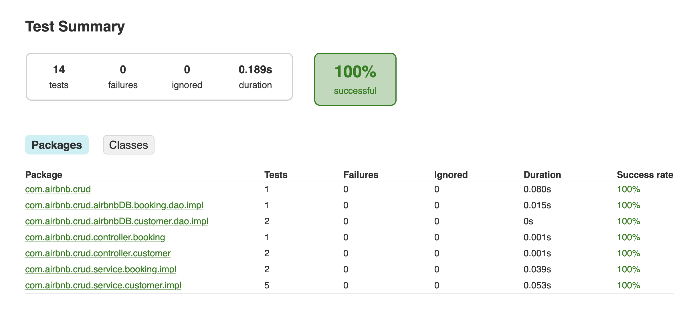
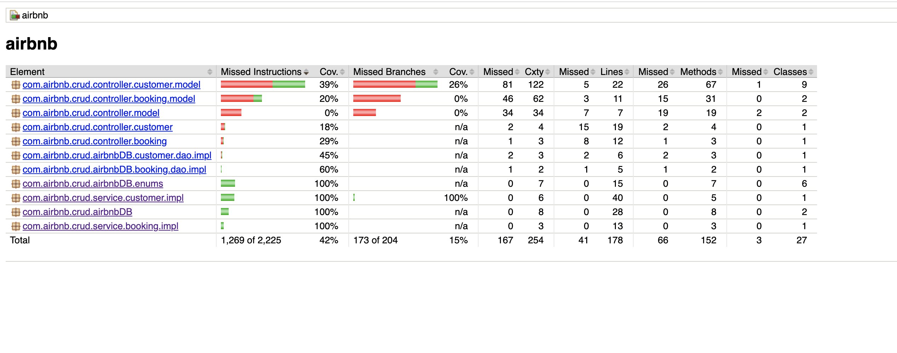

# spring-boot-clone
This project has sample code for a microservice written in spring boot.
This project takes care of below items.
* Package Structure
* JPA with Mysql
* Master Slave database set-up with spring boot 
* Rest API Implementation
* Rest API Documentation
* Logging
* Configuration Management
* Unit Test
* Functional Test 
* Code Coverage by Unit Test
* Code Coverage by Functional Test
* Monitoring

## Prerequisites
* [SpringBoot](https://spring.io/projects/spring-boot)
* [JPA with spring boot](https://spring.io/projects/spring-data-jpa)
* [Rest with sprint boot](https://spring.io/projects/spring-restdocs#overview)
* [MySql](https://dev.mysql.com/doc/mysql-installation-excerpt/5.7/en/installing.html)
* [Java 8]

## How to set up?
* Set up Database
    * Install mysql
    * Create new database schema named `mydb`
    * Copy the schema from `resources/schema.sql` and import the schema into `mydb` database. This will seed the database.
* Set up application
    * Provide the username, password and database url of the database in `resources/application.properties`.
    * Currently, we are using same database as master and slave.    
    ```properties
    spring.airbnb-master-datasource.url=${AIRBNB_MASTER_DB_HOST_URL:jdbc:mysql://localhost:3306/mydb}
    spring.airbnb-master-datasource.username=${AIRBNB_MASTER_DB_USERNAME:root}
    spring.airbnb-master-datasource.password=${AIRBNB_MASTER_DB_PASSWORD:root}
    spring.airbnb-slave-datasource.url=${AIRBNB_SLAVE_DB_HOST_URL:jdbc:mysql://localhost:3306/mydb}
    spring.airbnb-slave-datasource.username=${AIRBNB_SLAVE_DB_USERNAME:root}
    spring.airbnb-slave-datasource.password=${AIRBNB_SLAVE_DB_PASSWORD:root}
    ```
* Recursively download the dependent submodules. This will download the dependent library 'authy'. 
    ```shell script
    git submodule update --init --recursive
    ```
* Build the service. This will create a Jar file  `build/libs/airbnb-0.0.1-SNAPSHOT.jar`
    ```shell script
    ./gradlew clean build
    ```
* Run the service by below command
    ```shell script
    java -jar build/libs/airbnb-0.0.1-SNAPSHOT.jar
    ```  
* The service must start on port 8080.

### API Documentation
We are using [swagger](https://swagger.io/) to provide the documentation of the APIs.
Once application is in running state, 
*   you can find the documentation at `http://localhost:8080/swagger-ui.html`.
*   you can find the api-docs at `http://localhost:8080/v2/api-docs`
*   you can use swagger to test the APIs.

### Tests and Code Coverage Report
*   There are two types of tests written in the service, Unit Tests and Functional Tests.
*   Unit tests classes are suffixed with `UnitTest` and Functional tests are suffixed with `FunctionalTest`.
*   To run unit tests. This will run all unit tests and record the code coverage.  
    ```shell script
    ./gradlew test --tests '*UnitTest'
    ```
*   To run functional tests. This will run all functional tests and record the code coverage.  
    ```shell script
    ./gradlew test --tests '*FunctionalTest'
    ```
*   Test report will be generated at `build/reports/tests/test/index.html`. 
    *   Open this file in the browser to view the tests report. `http://localhost:63342/airbnb/build/reports/tests/test/index.html`
*   Code Coverage report will be generated at `build/reports/jacoco/jacocoHtml/index.html`
    *   Open this file in the browser to view the code coverage. `http://localhost:63342/airbnb/build/reports/jacoco/jacocoHtml/index.html`     

*   Sample tests report looks like below

*   Sample code coverage report looks like below
  

### Monitoring
*   We are using actuator and prometheus to emit the metrics of the service like resource usages, API latency, API throughput etc. 
*   Metrics can be obtained at `http://localhost:8080/metrics`  

 